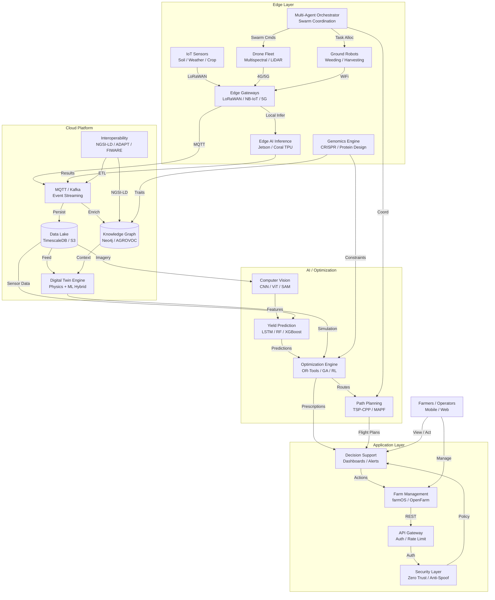
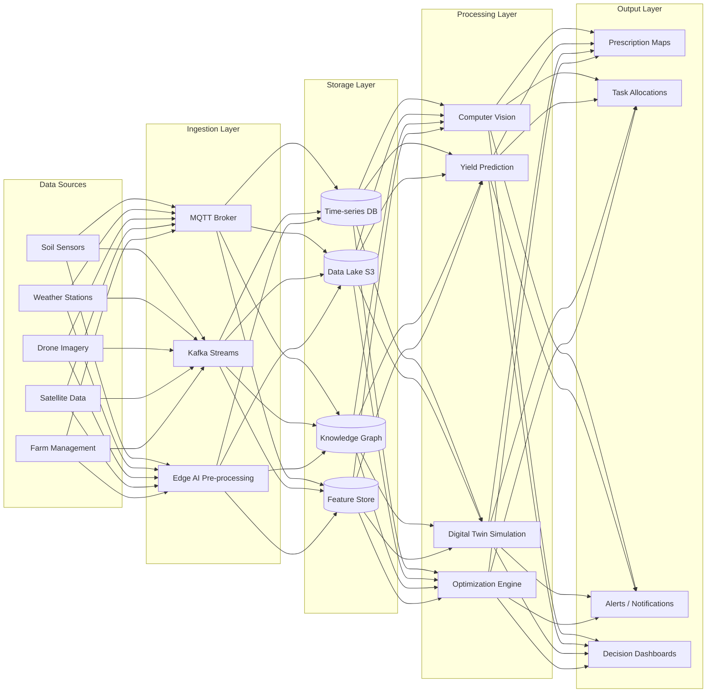
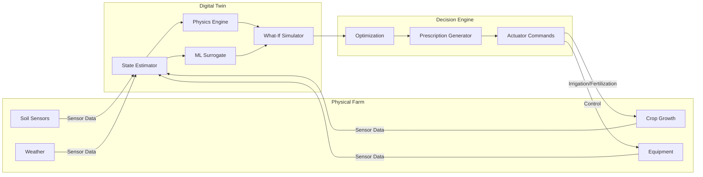
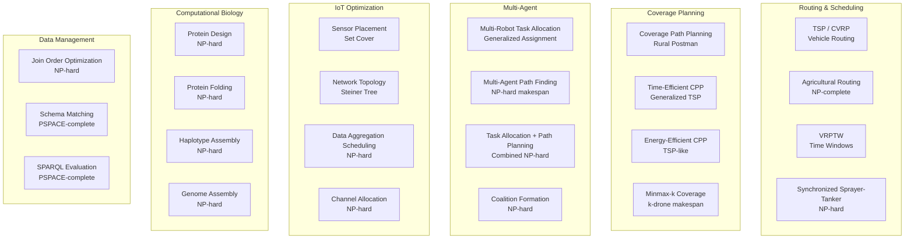

# AgTech Unified

**Unified Precision Agriculture & Genetic Engineering Platform**

A comprehensive, modular AgTech system integrating IoT sensors, drone fleets, ground robots, edge AI, digital twins, multi-agent swarm coordination, and genomic engineering — all unified under a single macro architecture.

Built with strict TDD (Test-Driven Development). 355 tests passing across 18 modules.

---

## Table of Contents

- [Architecture Overview](#architecture-overview)
- [System Diagrams](#system-diagrams)
- [Module Reference](#module-reference)
- [NP-Hard Problem Map](#np-hard-problem-map)
- [Research Findings](#research-findings)
- [Quick Start](#quick-start)
- [Testing](#testing)
- [GPU Acceleration](#gpu-acceleration)
- [Security](#security)
- [Interoperability](#interoperability)

---

## Architecture Overview

The system is organized into four layers:

| Layer | Components | Purpose |
|-------|-----------|---------|
| **Edge Layer** | IoT Sensors, Drone Fleet, Ground Robots, Edge Gateways, Edge AI, Multi-Agent Orchestrator, Genomics Engine | Real-time data collection, local inference, swarm coordination |
| **Cloud Platform** | MQTT/Kafka, Data Lake, Knowledge Graph, Digital Twin, Interoperability (NGSI-LD/FIWARE) | Event streaming, storage, semantic enrichment, simulation |
| **AI / Optimization** | Computer Vision, Yield Prediction, Optimization Engine, Path Planning, GPU TSP/VRP | Disease detection, yield forecasting, NP-hard optimization |
| **Application Layer** | Decision Support, Farm Management, API Gateway, Security, Dashboard, Alerts | User interaction, real-time monitoring, secure access |

---

## System Diagrams

### Macro Architecture



### Data Flow Architecture



### Multi-Agent Coordination Flow

```mermaid
sequenceDiagram
    participant F as Farmer
    participant DS as Decision Support
    participant MA as Multi-Agent Orchestrator
    participant OPT as Optimization Engine
    participant D as Drone Fleet
    participant R as Ground Robots
    participant PP as Path Planner

    F->>DS: View farm status / Set goals
    DS->>MA: Task requirements
    MA->>OPT: Resource allocation request
    OPT-->>MA: Allocation plan
    MA->>PP: Route optimization request
    PP-->>MA: Optimized paths
    MA->>D: Swarm commands (coverage paths)
    MA->>R: Task assignments (weeding/harvest)
    D-->>MA: Status / telemetry
    R-->>MA: Status / telemetry
    MA-->>DS: Execution progress
    DS-->>F: Real-time dashboard update
```

### Digital Twin Feedback Loop



---

## Module Reference

### Optimization (`src/optimization/`)

| Module | Algorithm | Complexity | Use Case |
|--------|-----------|------------|----------|
| `tsp.py` | Christofides (1.5-approx) + Nearest Neighbor | O(n²) | Drone route optimization |
| `vrp.py` | Clarke-Wright Savings | O(n² log n) | Vehicle routing with capacity |
| `gpu_tsp.py` | GPU-accelerated 2-opt | O(n²) parallel | Large-scale TSP on GPU |
| `gpu_vrp.py` | GPU-accelerated savings | O(n²) parallel | Large-scale VRP on GPU |
| `edge_ai.py` | ONNX Runtime inference | — | Edge deployment |
| `crop_vision.py` | CNN/ViT via ONNX | — | Disease detection, weed classification |

### Path Planning (`src/path_planning/`)

| Module | Algorithm | Use Case |
|--------|-----------|----------|
| `coverage.py` | Boustrophedon (lawnmower) | Field coverage for drones/robots |

### Multi-Agent (`src/multi_agent/`)

| Module | Algorithm | Use Case |
|--------|-----------|----------|
| `swarm.py` | Capability-based task distribution | Swarm coordination |
| `consensus.py` | PBFT-style Byzantine consensus | Fault-tolerant swarm decisions |
| `task_allocation.py` | Greedy + Hungarian | Multi-robot task assignment |

### IoT (`src/iot/`)

| Module | Algorithm | Use Case |
|--------|-----------|----------|
| `sensor_placement.py` | Greedy Set Cover | Optimal sensor deployment |
| `context_broker.py` | NGSI-LD entity CRUD | FIWARE context management |
| `smart_models.py` | NGSI-LD smart data models | Agricultural data modeling |
| `data_pipeline.py` | MQTT + Kafka + TimescaleDB | Real-time data streaming |

### Digital Twin (`src/digital_twin/`)

| Module | Algorithm | Use Case |
|--------|-----------|----------|
| `simulator.py` | Logistic growth model | Crop growth simulation |
| `knowledge_graph.py` | Entity-relationship graph | Agricultural knowledge management |
| `ontology.py` | AGROVOC semantic search | Standardized agricultural vocabulary |

### Decision Support (`src/decision_support/`)

| Module | Algorithm | Use Case |
|--------|-----------|----------|
| `recommender.py` | Rule-based engine | Irrigation, fertilization, pest alerts |
| `dashboard.py` | WebSocket streaming | Real-time farm monitoring |
| `alerts.py` | Threshold-based alerting | Multi-severity notification routing |
| `api_gateway.py` | REST + multi-tenant | Secure API access |
| `security.py` | JWT + RBAC + rate limiting | Zero-trust authentication |
| `gps_antispoof.py` | Signal analysis + anomaly detection | GPS spoofing detection |

### Genomics (`src/genomics/`)

| Module | Algorithm | Use Case |
|--------|-----------|----------|
| `crispr.py` | PAM site detection + efficiency scoring | CRISPR guide RNA design |
| `protein.py` | MW, pI, hydrophobicity, stability | Protein sequence analysis |

---

## NP-Hard Problem Map



---

## Research Findings

Based on 10-cluster parallel research (100 agents):

| Category | Count | Key Findings |
|----------|-------|-------------|
| **Bottlenecks** | 68 | Software maturity is #1 (not hardware); rural connectivity gaps; sensor drift |
| **NP-Hard Problems** | 58 | TSP variants, MRTA, MAPF, protein design, join ordering, schema matching |
| **OSS Projects** | 54 | ArduPilot, PX4, FIWARE, FarmVibes.AI, OR-Tools, PlantCV, AgML |
| **Gaps** | 80 | No commercial robot swarm deployment; 87% AI pilots never reach production |

### Key Research Insights

- **#1 bottleneck**: Software maturity (not hardware) — 27% US farm adoption rate
- **NP-hard core**: Coverage Path Planning (TSP-CPP), MRTA, irrigation scheduling (QUBO)
- **SOTA**: AlphaFold3 (2024 Nobel Prize), RFdiffusion (~100x success rate), prime editing
- **Hardware**: GPU acceleration 10-65x faster; 80GB GPU memory insufficient for genome assembly
- **Costs**: CRISPR $35-50M vs transgenic $100-136M; compute now exceeds sequencing cost
- **Governance**: US/EU regulatory divergence creates 1.5-3 year speed advantage

---

## Quick Start

### Prerequisites

```bash
python >= 3.10
pip install pytest numpy onnx onnxruntime
```

### Installation

```bash
git clone https://github.com/AAH20/agtech-unified.git
cd agtech-unified
pip install -e .
```

### Basic Usage

```python
from src.optimization.tsp import TSPSolver, TSPInstance

# Solve TSP
solver = TSPSolver(algorithm="christofides")
instance = TSPInstance(
    cities=["A", "B", "C"],
    distance_matrix=[[0, 10, 15], [10, 0, 12], [15, 12, 0]]
)
result = solver.solve(instance)
print(f"Tour: {result.tour}, Cost: {result.cost}")
```

### Running Tests

```bash
# All tests
python -m pytest tests/ -v

# Specific module
python -m pytest tests/test_tsp.py -v

# With coverage
python -m pytest tests/ --cov=src --cov-report=html
```

---

## Testing

**355 tests passing** across 18 modules.

| Test File | Tests | Module |
|-----------|-------|--------|
| `test_tsp.py` | 9 | TSP solver |
| `test_vrp.py` | 10 | VRP solver |
| `test_gpu_tsp.py` | 10 | GPU TSP |
| `test_gpu_vrp.py` | 10 | GPU VRP |
| `test_coverage.py` | 8 | Coverage planning |
| `test_swarm.py` | 10 | Swarm coordination |
| `test_consensus.py` | 10 | Byzantine consensus |
| `test_task_allocation.py` | 9 | Task allocation |
| `test_sensor_placement.py` | 9 | Sensor placement |
| `test_context_broker.py` | 10 | NGSI-LD broker |
| `test_smart_models.py` | 10 | Smart data models |
| `test_data_pipeline.py` | 21 | MQTT/Kafka/TimescaleDB |
| `test_streaming.py` | 12 | Streaming patterns |
| `test_digital_twin.py` | 10 | Digital twin |
| `test_knowledge_graph.py` | 24 | Knowledge graph |
| `test_ontology.py` | 16 | AGROVOC ontology |
| `test_decision_support.py` | 9 | Decision engine |
| `test_dashboard.py` | 12 | Real-time dashboard |
| `test_alerts.py` | 12 | Alert management |
| `test_api_gateway.py` | 10 | REST API |
| `test_security.py` | 11 | Zero-trust auth |
| `test_gps_antispoof.py` | 12 | GPS anti-spoofing |
| `test_edge_ai.py` | 10 | ONNX inference |
| `test_crop_vision.py` | 10 | Crop vision |
| `test_genomics.py` | 17 | CRISPR + protein |
| `test_integration_e2e.py` | 10 | End-to-end |
| `test_performance.py` | 10 | Benchmarks |
| `test_reliability.py` | 10 | Fault injection |

---

## GPU Acceleration

The platform leverages NVIDIA GPU acceleration for:

- **TSP/VRP solving**: Parallel 2-opt, batched distance matrices (PyTorch CUDA)
- **Edge AI inference**: ONNX Runtime with CUDA execution provider
- **Genomics**: AlphaFold, ProteinMPNN (future work)

### GPU Requirements

| Component | Minimum | Recommended |
|-----------|---------|-------------|
| GPU | NVIDIA with CUDA | RTX 2070+ |
| VRAM | 4 GB | 8 GB+ |
| CUDA | 11.0+ | 13.2 |
| Driver | 470+ | 595+ |

---

## Security

Zero-trust security layer:

- **JWT authentication** with HS256 signature verification
- **Role-based access control** (RBAC)
- **Rate limiting** with sliding-window algorithm
- **GPS anti-spoofing** with signal analysis and anomaly detection
- **Multi-tenant isolation** via NGSI-LD tenant headers

---

## Interoperability

Standards-compliant integration:

- **NGSI-LD** (FIWARE) context broker for IoT data
- **ADAPT** standard for agricultural data exchange
- **AGROVOC** ontology (35K+ concepts, 40+ languages)
- **ISO 18497** safety for agricultural robots
- **MAVLink** for drone communication

---

## License

MIT License — see [LICENSE](LICENSE) for details.

---

## Citation

```bibtex
@software{agtech_unified,
  author = {Hassan, Ahmed},
  title = {AgTech Unified: Precision Agriculture & Genetic Engineering Platform},
  year = {2026},
  url = {https://github.com/AAH20/agtech-unified}
}
```

---

**Generated**: 2026-10-04 | **Research**: 10 clusters, 100 agents | **Tests**: 355 passing | **Modules**: 18
